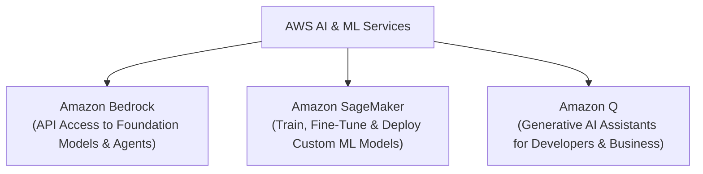
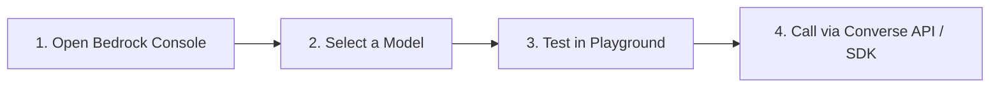

# AI & Machine Learning Services

Artificial Intelligence (AI) and Machine Learning (ML) represent one of the fastest-growing pillars of AWS. Whether you are consuming state-of-the-art Generative AI models via simple API calls or training custom foundation models from scratch, AWS provides end-to-end tooling.

---

## 1. Amazon Bedrock (Generative AI via API)

**Amazon Bedrock** is a fully managed service that provides unified API access to leading Foundation Models (FMs) from top AI companies alongside AWS's own native models.

- **Zero Infrastructure:** No servers, GPU clusters, or deep learning environments to manage; pay strictly per request/token.
- **Provider Choice:** Access foundation models from Anthropic (Claude), Meta (Llama), Mistral AI, Cohere, AI21 Labs, and Amazon (Nova). Check the AWS Bedrock Model Catalog for currently active model versions.
- **Data Privacy & Security:** Your prompts and proprietary data are never used to train base foundation models and are encrypted in transit (TLS) and at rest (KMS). To keep API traffic strictly within your private network without traversing the public internet, configure an **AWS PrivateLink interface VPC endpoint** (`com.amazonaws.<region>.bedrock-runtime`).

### Amazon Nova Foundation Models

**Amazon Nova** is AWS's proprietary family of foundation models designed for exceptional cost-efficiency and performance:

- **Nova Micro:** Ultra-fast, text-only model optimized for low-latency tasks and cost-sensitive text processing.
- **Nova Lite:** Fast, highly cost-effective multimodal model for processing text, images, and video.
- **Nova Pro:** Flagship multimodal model delivering high capability for complex reasoning, code generation, and agentic workflows.
*(Note: Always check the active Amazon Bedrock Model Catalog for current model versions and generative media capabilities).*

### Bedrock AgentCore & Autonomous Agents

**Bedrock AgentCore** provides enterprise infrastructure for orchestrating autonomous AI agents that can break down user requests, query knowledge bases (RAG), and securely execute actions via AWS Lambda functions or API endpoints.

---

## 2. Amazon SageMaker (End-to-End ML Platform)

**Amazon SageMaker** is the comprehensive machine learning platform built for data scientists and ML engineers who need to prepare data, train, fine-tune, and deploy custom machine learning algorithms.

- **SageMaker Studio:** Web-based integrated development environment (IDE) for ML workflows and Jupyter notebooks.
- **SageMaker HyperPod:** Purpose-built infrastructure cluster management designed for distributed training of trillion-parameter models with automated checkpointing and fault recovery.
- **SageMaker Serverless Inference:** Deploy machine learning models with automatic scaling and zero idle compute costs.

---

## 3. Amazon Q (AI Assistant)

**Amazon Q** is AWS's generative AI-powered conversational assistant:

- **Amazon Q Developer:** Integrated directly into your IDE (VS Code, JetBrains) and the AWS Management Console to assist with writing code, debugging errors, generating unit tests, and explaining AWS architectural configurations.
- **Amazon Q Business:** Connects to enterprise data repositories (Slack, Google Drive, Microsoft 365, Salesforce) to answer employee queries and automate business workflows with strict permission enforcement.

---

## How to Get Started with AI on AWS

1. Open the **Amazon Bedrock Console** in your target region.
2. **Select a Model:** Foundation models in commercial regions are enabled automatically as long as the caller has the appropriate IAM and AWS Marketplace permissions. *(Note: Anthropic Claude models additionally require submitting a one-time use-case form in the console).*
3. Use the **Playground** to test prompts, temperature settings, and model responses directly in the browser.
4. Integrate the model into your application code using the **Converse API** or AWS SDK (`boto3`, `@aws-sdk/client-bedrock-runtime`).

!!! tip "Beginner Recommendation: Start with Bedrock"
    If you are building applications that use LLMs (chatbots, document summarizers, smart search, agent workflows), start with **Amazon Bedrock**. You do not need machine learning expertise — simply call the API. Reserve **SageMaker** for scenarios where you need to train or fine-tune custom model architectures from scratch.
