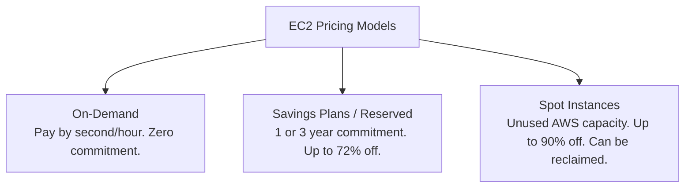
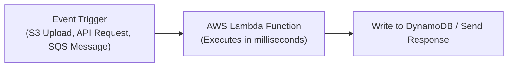
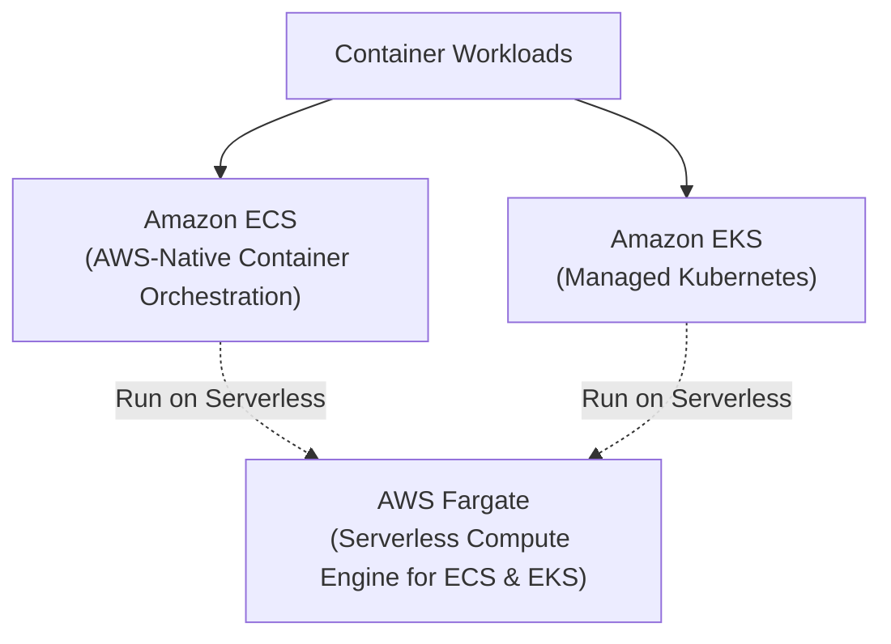

# Compute Services

Compute refers to the processing power, CPUs, and memory that execute your code and applications in the cloud.

---

## 1. Amazon EC2 (Elastic Compute Cloud)

**Amazon EC2** provides on-demand, scalable **virtual machines** (called *instances*). You have complete administrative control over the guest operating system, network configuration, and installed software.

### Instance Naming Scheme

EC2 instance names follow a standardized structure (e.g., `t4g.micro`, `m7i.large`, `c8a.xlarge`):

```
       m   7   g   .   large
       │   │   │         │
       │   │   │         └─ Size (vCPU & RAM multiplier)
       │   │   └─────────── Processor (g = AWS Graviton ARM, i = Intel, a = AMD)
       │   └─────────────── Generation (7th generation)
       └─────────────────── Instance Family
```

### Common Instance Families

| Family | Name | Best For | Example |
|---|---|---|---|
| **T** | General Purpose (Burstable) | Dev/test, low-traffic web apps, microservices | `t4g.micro`, `t3.small` |
| **M** | General Purpose (Balanced) | Production web servers, app servers | `m7i.large`, `m9g.large` |
| **C** | Compute Optimized | High-performance web servers, batch processing, video encoding | `c7g.xlarge`, `c8a.xlarge` |
| **R** | Memory Optimized | In-memory caches, high-performance databases | `r7g.large`, `r8g.2xlarge` |
| **G / P / Trn / Inf** | Accelerated Computing | AI/ML model training, GPU rendering, deep learning inference | `g6.xlarge`, `p5.48xlarge`, `trn3`, `inf2` |

!!! note "The Power of AWS Graviton (ARM64)"
    Instances with a lowercase **`g`** (e.g., `t4g`, `m7g`, `c7g`) run on AWS's custom **Graviton ARM-based processors**. Graviton chips offer up to **40% better price-performance** over comparable x86 instances. AWS's newest generation, **Graviton5** (powering the `M9g` family), delivers massive improvements for modern containerized and AI workloads.

---

### EC2 Pricing & Purchasing Options



- **On-Demand:** Pay strictly for running seconds. Ideal for short-term, spiky, or unpredictable workloads.
- **Savings Plans / Reserved Instances (RI):** Commit to a steady amount of compute (measured in $/hr or specific instances) for 1 or 3 years. Delivers discounts up to 72%.
- **Spot Instances:** Bid on spare AWS compute capacity for up to **90% discount**. However, AWS can reclaim the instance with a 2-minute warning. Ideal for batch jobs, CI/CD runners, and stateless workers.

---

### Launching and Connecting to an EC2 Instance

1. Open **EC2 Console** → **Launch Instance**.
2. Select an **AMI (Amazon Machine Image)** — e.g., Amazon Linux 2023 (AL2023) or Ubuntu 24.04 LTS.
3. Select an instance type (e.g., `t3.micro` or `t4g.micro`).
4. Configure a **Key Pair** (`.pem` format) and download it to your local machine.
5. Configure a **Security Group** allowing inbound SSH (port 22) from your IP.
6. Click **Launch Instance**.

#### Connecting via SSH

```bash
# 1. Restrict key file permissions (required by SSH clients)
chmod 400 my-aws-key.pem

# 2. Connect to the public IP or DNS
ssh -i "my-aws-key.pem" ec2-user@<public-ip-or-dns>
```

---

## 2. AWS Lambda (Serverless Compute)

**AWS Lambda** executes your code without requiring server provisioning, OS patching, or cluster management. You pay solely for the milliseconds your code executes.



- **Execution Model:** Event-driven (triggered by HTTP via API Gateway, file uploads to S3, queue messages in SQS, or scheduled cron timers).
- **Supported Runtimes:** Python, Node.js, Java, .NET, Ruby, and custom runtimes (like Go and Rust compiled to Linux binaries via `provided.al2023`).
- **Scaling:** Automatically scales from zero to tens of thousands of concurrent executions.
- **Max Execution Timeout:** 15 minutes per invocation.
- **Cost Savings Tip:** Switch your Lambda architecture to **`arm64` (Graviton)** in the configuration tab for a free ~20% price-performance gain!

#### Example Lambda Handler (Python)

```python
import json

def lambda_handler(event, context):
    name = event.get("queryStringParameters", {}).get("name", "Cloud Explorer")
    
    return {
        "statusCode": 200,
        "headers": {"Content-Type": "application/json"},
        "body": json.dumps({"message": f"Welcome to AWS, {name}!"})
    }
```

---

## 3. Container Services: ECS, EKS & Fargate

Containers package code and all its dependencies into an immutable image (Docker).



- **Amazon ECS (Elastic Container Service):** AWS's streamlined, highly integrated container orchestrator. Perfect for microservices without Kubernetes complexity.
- **Amazon EKS (Elastic Kubernetes Service):** Fully managed Kubernetes control plane compatible with upstream Kubernetes tooling (kubectl, Helm).
- **AWS Fargate:** Serverless compute engine for containers. With Fargate, you deploy your container tasks directly without managing any underlying EC2 virtual machines.

---

## 4. AWS Elastic Beanstalk & App Runner

- **AWS Elastic Beanstalk:** A Platform-as-a-Service (PaaS) where you upload web application code (Java, .NET, PHP, Node.js, Python, Ruby, Go, Docker) and AWS manages provisioning, load balancing, auto-scaling, and health monitoring.
- **AWS App Runner:** A modern fully managed service that takes container images or source code and deploys scalable web applications with automatic HTTPS, SSL, and load balancing in minutes.
