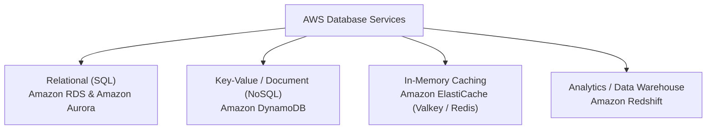

# Database Services

AWS provides purpose-built database engines tailored to specific data models and access patterns.

---

## 1. Amazon RDS (Relational Database Service)

**Amazon RDS** simplifies the setup, operation, and scaling of traditional relational (SQL) databases in the cloud. AWS handles routine database administration tasks including provisioning, OS and engine patching, automated daily backups, and point-in-time recovery.

### Supported Database Engines

- PostgreSQL
- MySQL
- MariaDB
- Oracle Database
- Microsoft SQL Server

### Key RDS Capabilities

- **Multi-AZ Deployments:** Synchronous replication to a standby instance in a different Availability Zone with automatic failover in the event of hardware or AZ failures.
- **Read Replicas:** Asynchronous read-only copies used to offload heavy read queries from the primary database instance.
- **Automated Snapshots & Point-In-Time Restore:** Restore database state to any second within your retention window (up to 35 days).

---

## 2. Amazon Aurora

**Amazon Aurora** is AWS's cloud-native, high-performance relational database engine compatible with MySQL and PostgreSQL.

- **Speed:** Up to **5x the throughput of standard MySQL** and **3x the throughput of standard PostgreSQL**.
- **Fault-Tolerant Storage:** Replicates 6 copies of your data across 3 Availability Zones. It automatically self-heals and dynamically grows storage up to **128 TB**.
- **Aurora Serverless v2:** Automatically adjusts database compute capacity (measured in Aurora Capacity Units or ACUs) in fractions of a second based on application demand, scaling down to save costs during idle periods.

---

## 3. Amazon DynamoDB (Serverless NoSQL)

**Amazon DynamoDB** is a fully managed, serverless, ultra-fast NoSQL database delivering consistent single-digit millisecond response times at any scale.

- **Serverless Architecture:** Zero servers to provision, patch, or manage.
- **Data Model:** Flexible key-value and JSON document storage.
- **Capacity Modes:**
    - **On-Demand Mode:** Automatically accommodates workloads as they ramp up or down without capacity planning.
    - **Provisioned Mode:** Specify expected Read Capacity Units (RCUs) and Write Capacity Units (WCUs).
- **Global Tables:** Fully managed multi-Region, multi-active database replication for global applications.
- **Always Free Tier:** 25 GB of storage + 25 WCUs & 25 RCUs every month permanently.

---

## 4. Amazon ElastiCache (In-Memory Caching)

**Amazon ElastiCache** improves the response times of read-heavy web applications by retrieving data from fast, managed in-memory data stores rather than querying slower disk-based databases.

### Supported In-Memory Engines

- **Valkey:** An open-source, high-performance key-value data store created as an open fork of Redis. ElastiCache for Valkey delivers full compatibility with lower cost and superior throughput.
- **Redis OSS:** Popular in-memory data structure store supporting strings, hashes, lists, sets, and geospatial indexes.
- **Memcached:** Simple, multi-threaded in-memory object caching system.

---

## Database Selection Matrix

| Database Service | Data Model | Typical Use Cases |
|---|---|---|
| **Amazon RDS** | Relational (SQL) | E-commerce transaction processing, ERP systems, existing SQL apps |
| **Amazon Aurora** | High-Performance SQL | Enterprise-grade transactional workloads, SaaS multi-tenant platforms |
| **Amazon DynamoDB** | NoSQL (Key-Value / JSON) | User profiles, gaming leaderboards, shopping carts, IoT telemetry, high-scale APIs |
| **Amazon ElastiCache** | In-Memory | Web session storage, database query caching, real-time analytics |
| **Amazon Redshift** | Columnar Data Warehouse | Complex business intelligence (BI) reports, historical analytics, OLAP |
| **Amazon DocumentDB** | MongoDB-compatible Document | JSON document workloads using MongoDB-compatible APIs and drivers; verify supported operations before migration |
