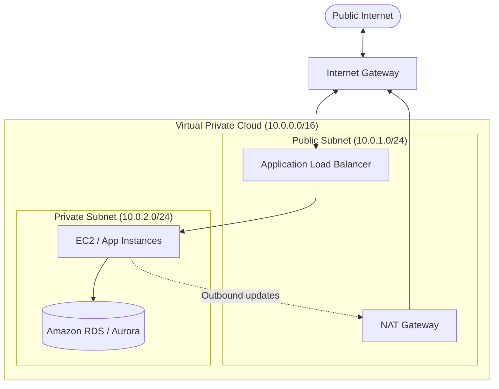
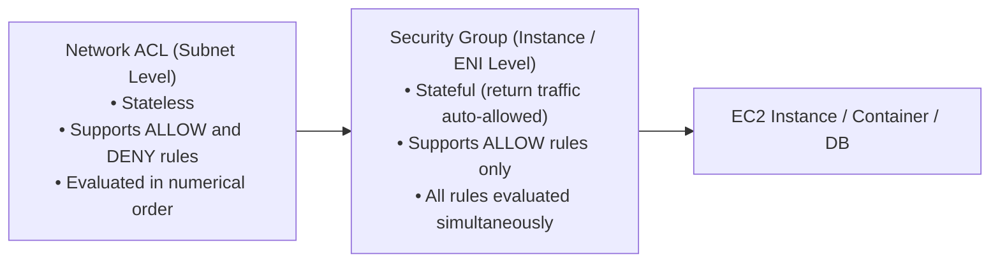

# Networking Services

Networking on AWS establishes secure, isolated communication between your cloud resources and the public internet.

---

## 1. Amazon VPC (Virtual Private Cloud)

An **Amazon VPC** is a logically isolated virtual network dedicated to your AWS account. It mimics a traditional on-premises data center network with complete control over IP address ranges, subnets, route tables, and gateways.

### Key VPC Components

- **Subnets:** Segments of a VPC's IP address range assigned to a specific Availability Zone.
    - **Public Subnet:** Contains a direct route table entry to an **Internet Gateway (IGW)**, enabling resources with public IPs to communicate with the internet.
    - **Private Subnet:** Lacks a route to the internet. Ideal for databases and backend application tiers.
- **Internet Gateway (IGW):** A horizontally scaled VPC component that allows communication between your VPC and the internet.
- **NAT Gateway (Network Address Translation):** Placed in a public subnet to allow instances inside private subnets to initiate outbound internet traffic (e.g., software updates, package downloads) while blocking unauthorized inbound connections from reaching them.
- **Route Tables:** A set of routing rules that determine where network traffic is directed.

---

### CIDR Notation & The 5 Reserved IPs

VPC IP blocks are defined using **CIDR (Classless Inter-Domain Routing)** notation:

| CIDR Prefix | Subnet Mask | Total IP Addresses | Usable AWS IPs |
|---|---|---|---|
| `/16` | `255.255.0.0` | 65,536 | 65,531 |
| `/24` | `255.255.255.0` | 256 | 251 |
| `/28` | `255.255.255.240` | 16 | 11 |

!!! important "AWS Reserves 5 IPs in Every Subnet"
    In every subnet you create, AWS automatically reserves the first 4 IP addresses and the last IP address:
    
    1. **First address (`.0`)** — Network address (e.g., `10.0.1.0` for a `/24` or `10.0.1.0` for a `/28`)
    2. **Second address (`.1`)** — Reserved for the VPC router
    3. **Third address (`.2`)** — Reserved by AWS for DNS server resolution
    4. **Fourth address (`.3`)** — Reserved for future AWS internal use
    5. **Last address** — Network broadcast address (e.g., `.255` for a `/24`, or `.15` for a `/28`)

---

### Security Groups vs. Network ACLs (NACLs)

AWS provides two layers of firewalls to defend your network:

| Feature | Security Group (SG) | Network ACL (NACL) |
|---|---|---|
| **Operating Layer** | Instance / Elastic Network Interface (ENI) | Subnet boundary |
| **State Nature** | **Stateful** (Return traffic is automatically permitted) | **Stateless** (Inbound and outbound rules must be explicitly allowed) |
| **Rule Capabilities** | **Allow** rules only (Implicit deny) | **Allow** AND **Deny** rules |
| **Evaluation** | All rules evaluated together | Evaluated in strict sequential rule number order |

---

## 2. Amazon Route 53 (DNS & Traffic Management)

**Amazon Route 53** is a highly available and scalable Domain Name System (DNS) web service:

- **Domain Registration:** Purchase and manage custom domains directly within AWS.
- **Routing Policies:** Simple, Weighted, Latency-based, Geolocation, Multi-Value Answer, and Failover routing.
- **Health Checks:** Continuously checks the health of your endpoints and routes users away from unhealthy servers.
- **Alias Records:** AWS-specific DNS extensions that point apex domains (`example.com`) directly to CloudFront, ALBs, or S3 websites with zero performance degradation.

---

## 3. Amazon CloudFront (Content Delivery Network)

**Amazon CloudFront** is AWS's global CDN that speeds up the distribution of static and dynamic web content (HTML, CSS, JS, media files, APIs) using the worldwide network of 750+ Edge Locations.

- **Origin Types:** Amazon S3 buckets, Application Load Balancers, EC2 instances, or custom on-premises web servers.
- **Security:** Built-in DDoS protection via **AWS Shield Standard** and seamless integration with **AWS WAF** (Web Application Firewall) and **AWS Certificate Manager (ACM)** for SSL/TLS certificates.

---

## 4. Elastic Load Balancing (ELB)

ELB automatically distributes incoming application traffic across multiple targets (EC2 instances, containers, IP addresses, Lambda functions) in multiple Availability Zones.

| Load Balancer Type | Layer (OSI) | Protocol | Best Use Case |
|---|---|---|---|
| **ALB (Application Load Balancer)** | Layer 7 | HTTP, HTTPS, gRPC, WebSockets | Advanced path-based routing, microservices, container applications |
| **NLB (Network Load Balancer)** | Layer 4 | TCP, UDP, TLS | Ultra-high throughput, extreme performance, static IP addresses |
| **GLB (Gateway Load Balancer)** | Layer 3 | IP Packets | Deploying and scaling third-party virtual security appliances (firewalls, IDS/IPS) |
