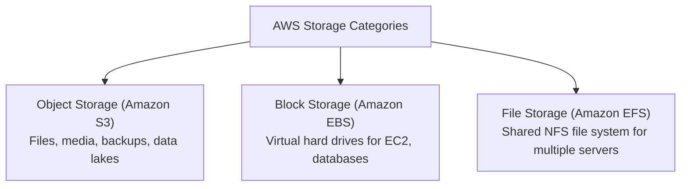

# Storage Services

AWS offers specialized storage solutions categorized into **Object Storage**, **Block Storage**, and **File Storage**.



---

## 1. Amazon S3 (Simple Storage Service)

**Amazon S3** is an object storage service designed for storing any amount of unstructured data (images, videos, documents, backups, machine learning datasets, static web assets).

- **Durability:** 99.999999999% (**11 nines**) of durability across multiple Availability Zones.
- **Consistency:** Strong read-after-write consistency for all `PUT` and `DELETE` requests.
- **Structure:** Objects (files) are stored inside **Buckets** (containers with globally unique names across all AWS accounts worldwide).

### S3 Storage Classes

Optimize storage costs by matching your data access frequency with the appropriate tier:

| Storage Class | Best For | Retrieval Time | Relative Cost |
|---|---|---|---|
| **S3 Standard** | Frequently accessed data, active web assets | Milliseconds | Standard |
| **S3 Intelligent-Tiering** | Unknown or changing access patterns (auto-moves data) | Milliseconds | Standard + small monitoring fee (zero retrieval fee) |
| **S3 Standard-IA** | Infrequent access (e.g., monthly reports, disaster recovery) | Milliseconds | Lower storage, per-GB retrieval fee |
| **S3 Express One Zone** | High-performance, latency-critical analytics & AI training | Single-digit ms | Optimized for high IOPS |
| **S3 Glacier Instant Retrieval** | Archive data accessed once a quarter | Milliseconds | Very low |
| **S3 Glacier Flexible Retrieval** | Standard archives (e.g., yearly compliance logs) | 1 min to 5 hours | Extremely low |
| **S3 Glacier Deep Archive** | Long-term cold data retention (7–10 years) | 12 to 48 hours | Lowest cost ($0.00099 / GB/mo) |

---

### Common S3 CLI Commands

```bash
# Create a new globally unique bucket
aws s3 mb s3://my-cloud-guide-bucket-2026

# Upload a local file to S3
aws s3 cp app.log s3://my-cloud-guide-bucket-2026/logs/

# Download a file from S3
aws s3 cp s3://my-cloud-guide-bucket-2026/logs/app.log ./

# Synchronize a local directory with an S3 bucket
aws s3 sync ./dist s3://my-cloud-guide-bucket-2026/website/

# List files inside a bucket
aws s3 ls s3://my-cloud-guide-bucket-2026/

# Delete an object
aws s3 rm s3://my-cloud-guide-bucket-2026/logs/app.log
```

---

### Hosting a Static Website with S3 & CloudFront

Static websites (HTML, CSS, JS, React/Vue SPAs) are typically hosted using one of two patterns:

1. **CloudFront + Private S3 with Origin Access Control (OAC) — Recommended Standard:**  
   Keep S3 **Block Public Access enabled** and leave S3 Static Website Hosting **disabled** (bucket remains 100% private). Point CloudFront to the S3 REST API endpoint, attach an **Origin Access Control (OAC)**, and set an S3 bucket policy allowing access exclusively from your CloudFront distribution.
2. **S3 Static Website Hosting (Direct HTTP Endpoint):**  
   Enable **Static Website Hosting** in Bucket Properties, disable Block Public Access, and attach a public read bucket policy. S3 serves files over a direct HTTP website endpoint (`http://<bucket-name>.s3-website.<region>.amazonaws.com`). If CloudFront is placed in front of this endpoint, it acts as a custom HTTP origin and cannot use OAC.

---

## 2. Amazon EBS (Elastic Block Store)

**Amazon EBS** provides persistent **block storage volumes** attached directly to EC2 instances over high-speed local network connections (equivalent to a virtual SSD or NVMe drive).

- Persists independently of the EC2 instance (can be detached and attached to another instance in the same AZ).
- Automatically replicated within its Availability Zone for hardware redundancy.
- Point-in-time backups can be captured as **EBS Snapshots** (stored durably in Amazon S3).

### EBS Volume Types

- **`gp3` (General Purpose SSD — Recommended Default):** Provides baseline 3,000 IOPS and 125 MB/s throughput at all volume sizes, up to 20% cheaper than legacy `gp2`.
- **`io2` Block Express (Provisioned IOPS SSD):** Designed for mission-critical, high-throughput relational databases (Oracle, MS SQL Server, SAP HANA).
- **`st1` / `sc1` (HDD):** Low-cost mechanical storage for high-throughput sequential data logging or cold block data.

---

## 3. Amazon EFS (Elastic File System)

**Amazon EFS** is a fully managed, serverless **NFS (Network File System)** that can be mounted simultaneously by hundreds of EC2 instances, ECS/EKS containers, or Lambda functions across multiple Availability Zones.

- Automatically grows and shrinks as files are added or deleted (no pre-provisioning required).
- Shared POSIX filesystem semantics (read/write concurrency across multiple compute instances).

---

## Storage Summary & Comparison

| Feature | Amazon S3 | Amazon EBS | Amazon EFS |
|---|---|---|---|
| **Storage Type** | Object Storage (Key-Value) | Block Storage (Raw Disk) | File Storage (NFS File Tree) |
| **Max Size** | Unlimited (5 TB max per object) | 64 TB per volume | Petabyte scale (elastic) |
| **Attached To** | Accessible via REST API / SDK / Web | Single EC2 instance in same AZ | Multiple EC2s / Containers / Lambdas |
| **Primary Use** | Web assets, backups, data lakes | OS boot disks, database data files | Shared file storage, CMS media pools |
