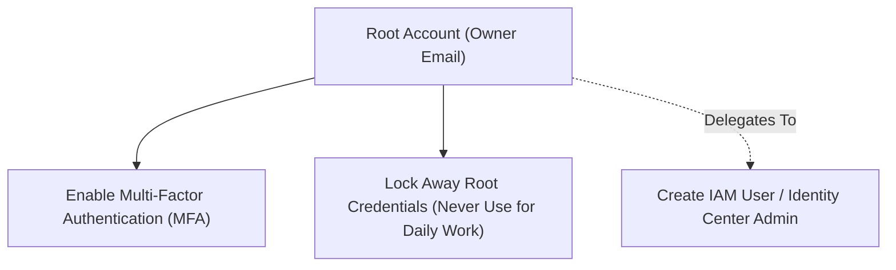

# Setting Up Your AWS Account

Setting up your AWS account properly from day one ensures that your infrastructure is secure, cost-controlled, and easy to manage.

---

## Step 1: Create a Free AWS Account

1. Go to [https://aws.amazon.com](https://aws.amazon.com).
2. Click **Create an AWS Account**.
3. Provide your email address, account name, and choose a strong password.
4. Enter billing information (a credit/debit card is required for identity verification; usage within Free Tier limits will not incur charges).
5. Complete identity verification via SMS or phone call.
6. Select the **Basic Support (Free)** plan.

---

## Step 2: Secure Your Root Account Immediately

Your **root account** has unrestricted, god-mode access to all resources and billing across the entire AWS account. Compromise of the root account can lead to disastrous security and financial consequences.

!!! danger "Never Use Root for Everyday Tasks"
    - **Enable Multi-Factor Authentication (MFA)** on the root account immediately using a hardware security key or authenticator app (e.g., 1Password, Google Authenticator).
    - **Never generate access keys** for the root account.
    - Create an **IAM user** or **IAM Identity Center user** with appropriate permissions for daily development (see [IAM & Security](../security-monitoring/iam-security.md)).

---

## Step 3: Set a Zero-Dollar / Low Billing Alarm

Prevent surprise bills before launching any servers or databases:

1. In the AWS Console, search for and open **CloudWatch**.
2. Navigate to **Alarms** → **Billing** (or go to **AWS Budgets** in the Billing console).
3. Create an alarm for `$5` or `$10` with your email address to receive immediate notifications if usage crosses your threshold.

---

## AWS Free Tier Explained

!!! important "Current AWS Free Tier Model (July 15, 2025 Onward)"
    AWS overhauled the Free Tier model for all new accounts starting **July 15, 2025**.

When signing up, you choose between a **Free Plan** or **Paid Plan**:

- **$100 in AWS Credits** granted automatically at signup.
- Up to **$100 in additional credits** by completing onboarding steps (such as launching an EC2 instance, exploring Amazon Bedrock, or creating an AWS Budget).
- **Credit Validity:** Credits remain valid for **12 months** from account creation.
- **Free Plan Lifespan:** The Free Plan concludes after **6 months** (or when your credits are fully exhausted). When the Free Plan ends, AWS **closes the account** and removes access to resources (preventing any surprise billing), retaining your data for a **90-day grace period** during which you can upgrade to a Paid Plan to recover access before permanent deletion.
- **Paid Plan:** If you choose or upgrade to the Paid Plan, once credits are depleted standard on-demand billing begins automatically.
- *Note:* The legacy "750 hours/month for 12 months" allowances (EC2, RDS, etc.) have been retired for new signups; usage now simply draws down your credit balance.

---

## Always Free Services (All Accounts, Never Expires)

Over 30 AWS services provide permanent, non-expiring usage tiers regardless of account age:

| Service | Always Free Allowance |
|---|---|
| **AWS Lambda** | 1,000,000 requests/month + 400,000 GB-seconds of compute/month (e.g., 3.2M seconds at 128 MB RAM, or 400k seconds at 1 GB RAM) |
| **Amazon DynamoDB** | 25 GB storage + 25 WCU & 25 RCU capacity |
| **Amazon CloudWatch** | 10 custom metrics + 10 alarms + 5 GB log ingestion |
| **Amazon SNS** | 1,000,000 publishes/month |
| **Amazon SQS** | 1,000,000 requests/month |
| **AWS Step Functions** | 4,000 state transitions/month |

!!! tip "Verify Your Account Status"
    Always check your active allowance and credits directly in the **Billing & Cost Management Dashboard → Free Tier** page.

---

## Historical Context: Legacy 12-Month Free Tier (Pre-July 2025)

> *Note for readers referencing older tutorials:* Prior to July 15, 2025, AWS offered a fixed 12-month tier (750 hours/month of `t2.micro`/`t3.micro` EC2, 5 GB S3, 750 hours `db.t2.micro` RDS, 30 GB EBS). Because all accounts created under that model have now concluded their 1-year eligibility, all active accounts today operate under the current credit model or standard on-demand billing alongside the permanent Always Free tier.
