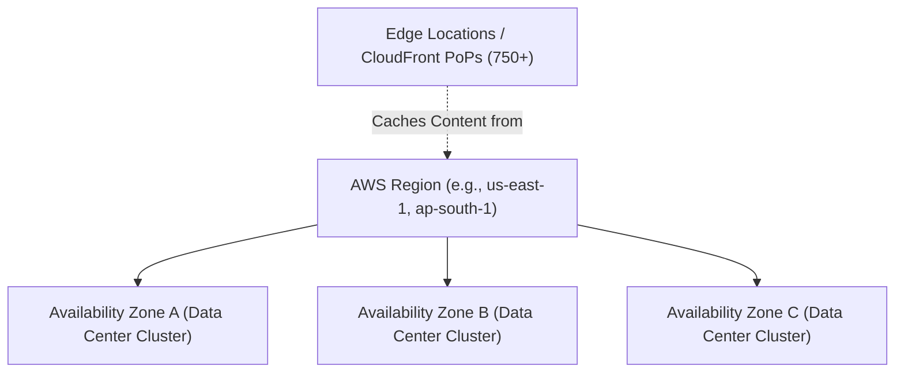

# AWS Global Infrastructure

AWS operates one of the world's most resilient and widely distributed cloud networks. Understanding its physical layout enables you to design high-performance, fault-tolerant architectures.

---

## 1. Regions

A **Region** is a separate geographic area (e.g., `us-east-1` in N. Virginia, `eu-west-1` in Ireland, `ap-south-1` in Mumbai). Each region is completely autonomous and isolated from all other regions.

As of 2026, AWS operates **37+ Regions** globally (including dedicated digital sovereignty regions such as the **AWS European Sovereign Cloud**, operated exclusively within the EU by EU-resident personnel).

### How to Choose a Region

When launching resources, choose your Region based on:

1. **Proximity to Users:** Lower latency for your end users.
2. **Data Sovereignty & Compliance:** Legal requirements dictating that data must reside within specific national borders (e.g., GDPR in Europe, HIPAA in the US).
3. **Service Availability:** Newer services (e.g., specialized Bedrock models or cutting-edge EC2 instances) typically launch first in major regions (`us-east-1`, `us-west-2`, `eu-west-1`).
4. **Cost:** Pricing varies slightly by region based on local taxes and power costs.

---

## 2. Availability Zones (AZs)

Each AWS Region contains a **minimum of three Availability Zones** (e.g., `us-east-1a`, `us-east-1b`, `us-east-1c`). 

- An **AZ** consists of one or more physically distinct data centers equipped with independent power, cooling, and network links.
- AZs within the same region are separated by a meaningful physical distance (up to ~60 miles / 100 km) to prevent correlated disaster impact (e.g., floods or local power grid outages), yet connected by ultra-low latency fiber to allow synchronous data replication.
- AWS operates **100+ Availability Zones** globally.

!!! tip "High Availability Rule of Thumb"
    Never deploy all your instances or database nodes in a single AZ. Distribute workloads across at least **two AZs** so that if an AZ suffers an unexpected outage, your application remains online.

---

## 3. Edge Locations & Points of Presence (PoPs)

AWS runs a global edge network of **750+ Points of Presence** (including Edge Locations and Regional Edge Caches) in over 100 cities across 50+ countries.

- Edge Locations do not run full virtual machines; they cache static and dynamic web content closer to users via **Amazon CloudFront** (CDN) and accelerate DNS lookups via **Route 53**.
- This significantly reduces round-trip latency for global applications.

---

## 4. AWS Local Zones & Wavelength

- **AWS Local Zones:** Extensions of AWS Regions placed in major metropolitan areas lacking a full Region (e.g., Chicago, Los Angeles, Buenos Aires), designed for sub-10ms latency applications such as real-time gaming, live video rendering, and financial trading.
- **AWS Wavelength:** Embeds AWS compute and storage inside 5G telecommunications networks for ultra-low latency mobile edge computing.

---

## Common Region Codes

| Region Name | Identifier Code |
|---|---|
| US East (N. Virginia) | `us-east-1` |
| US West (Oregon) | `us-west-2` |
| Europe (Ireland) | `eu-west-1` |
| Europe (Frankfurt) | `eu-central-1` |
| Asia Pacific (Mumbai) | `ap-south-1` |
| Asia Pacific (Singapore) | `ap-southeast-1` |
| Asia Pacific (Tokyo) | `ap-northeast-1` |
| Asia Pacific (Sydney) | `ap-southeast-2` |
