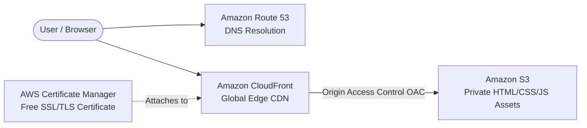
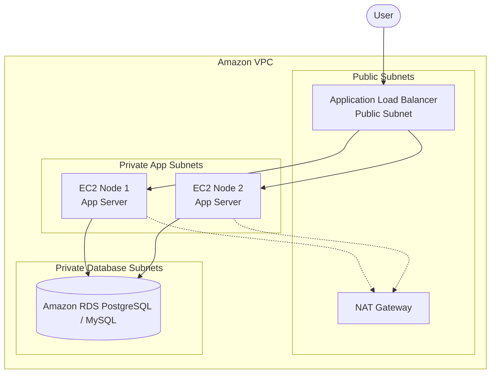
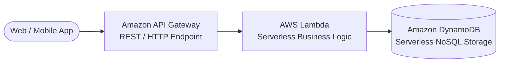
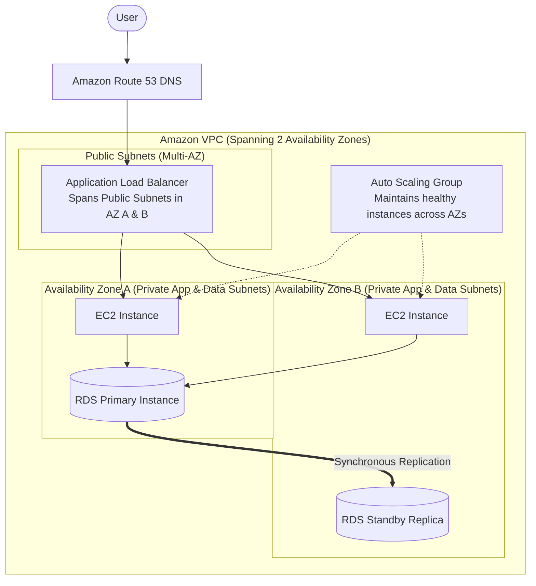

# Common Beginner Architectures

These reference architecture patterns represent common real-world building blocks used across modern cloud deployments.

---

## Architecture 1: Secure Static Website

- **Services Used:** Amazon S3, Amazon CloudFront, Amazon Route 53, AWS Certificate Manager (ACM).
- **Security Pattern:** The S3 bucket has *Block Public Access* fully enabled. Only CloudFront is authorized via **Origin Access Control (OAC)** to fetch objects.
- **Estimated Cost:** Typically **<\$1.00/month** for low-to-medium traffic websites (often covered entirely by the Free Tier).

---

## Architecture 2: Traditional Three-Tier Web Application

- **Services Used:** Amazon VPC, Application Load Balancer, Amazon EC2, Amazon RDS, NAT Gateway, Security Groups.
- **Key Design Principle:** The application servers and databases are kept strictly in private subnets with no public IP addresses. Only the ALB is exposed to the internet.

---

## Architecture 3: Fully Serverless API

- **Services Used:** Amazon API Gateway, AWS Lambda, Amazon DynamoDB, Amazon CloudWatch.
- **Key Benefits:** Zero servers to manage, automated zero-to-peak scaling, pay exclusively per invocation, and minimal idle cost.

---

## Architecture 4: Highly Available, Resilient Web Architecture

- **Services Used:** Amazon Route 53, Application Load Balancer (in public subnets), EC2 in Auto Scaling Group (in private app subnets), Amazon RDS Multi-AZ (in private database subnets), Amazon VPC.
- **Failover Mechanism:** 
    - **Compute Layer:** The ALB continuously performs health checks on individual EC2 instances. If an instance or an entire AZ suffers an outage, the ALB automatically stops sending traffic to unhealthy targets and routes all requests exclusively to healthy instances in the surviving AZ. The Auto Scaling Group concurrently provisions replacement instances.
    - **Database Layer:** If the primary RDS database node fails, Amazon RDS Multi-AZ automatically promotes the synchronous standby replica in AZ B to primary within 60–120 seconds, updating DNS records automatically with zero data loss.
