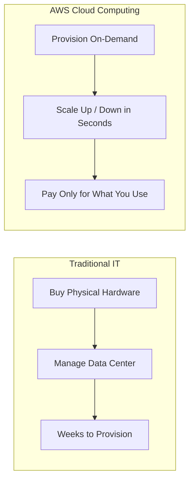
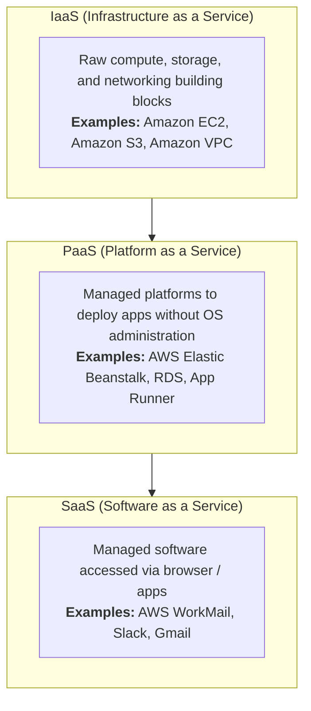

# AWS (Amazon Web Services) — Complete Beginner's Guide

> A practical, jargon-free introduction to the world's leading cloud platform.

---

## What is AWS?

**Amazon Web Services (AWS)** is a comprehensive cloud computing platform offered by Amazon. Instead of buying and maintaining your own physical servers, you rent computing resources — servers, storage, databases, networking, AI models, and more — over the internet, paying only for what you use.

### Why Use AWS?

| Traditional IT | AWS Cloud |
|---|---|
| Buy expensive hardware upfront | Pay only for what you use |
| Capacity fixed at purchase | Scale up or down in minutes |
| Weeks to provision servers | Servers ready in seconds |
| You manage physical hardware | AWS manages the data centers |
| Single location | 37+ global regions |

---

## Key Cloud Computing Models

Cloud services are generally grouped into three service models:

- **IaaS (Infrastructure as a Service)** — You manage the OS, runtimes, and applications while AWS manages the physical servers, virtualization, and data centers (e.g., EC2, S3, VPC).
- **PaaS (Platform as a Service)** — You focus exclusively on your application code; AWS manages OS provisioning, patching, scaling, and load balancing (e.g., Elastic Beanstalk, RDS).
- **SaaS (Software as a Service)** — Fully managed software delivered over the web (e.g., AWS WorkMail).

---

## Cloud Deployment Models

| Model | Description | Example |
|---|---|---|
| **Public Cloud** | Resources shared across customers and fully hosted by AWS | Standard AWS cloud workloads |
| **Private Cloud** | Dedicated cloud infrastructure operated for a single organization | AWS Outposts, AWS Dedicated Hosts |
| **Hybrid Cloud** | Connecting on-premises data centers seamlessly with the cloud | AWS Direct Connect, AWS Storage Gateway |

---

## Key Terminology

- **Instance** — A virtual server running in the cloud.
- **Resource** — Any AWS component you create (server, database, bucket, VPC, etc.).
- **Service** — A category of cloud functionality (e.g., EC2, S3, RDS, DynamoDB).
- **Console** — The web-based graphical dashboard used to manage AWS resources.
- **CLI** — Command Line Interface for automating and managing AWS from your terminal.
- **SDK** — Software Development Kit to interact with AWS from your code (Python, TypeScript/JavaScript, Go, Java, Swift, etc.).
- **ARN** — *Amazon Resource Name*; a globally unique identifier for every AWS resource (e.g., `arn:aws:s3:::my-bucket`).

---

## How to Navigate This Guide

Use the navigation sidebar to explore each topic step-by-step:

1. **[Account Setup & Free Tier](getting-started/account-setup.md)** — Setting up your account, securing root, setting billing alarms, and understanding the Free Tier.
2. **[Global Infrastructure](getting-started/global-infrastructure.md)** — Regions, Availability Zones, Edge Locations, and Local Zones.
3. **[Core Services](core-services/compute.md)** — Compute, Storage, Networking, and Databases.
4. **[AI & Machine Learning](ai-ml/bedrock-sagemaker.md)** — Amazon Bedrock, Nova foundation models, and SageMaker.
5. **[Security & Monitoring](security-monitoring/iam-security.md)** — IAM, Least Privilege, CloudWatch, and CloudTrail.
6. **[Pricing & Cost Management](pricing-cost/pricing-cost.md)** — Understanding billing and avoiding surprise charges.
7. **[Hands-On & Architectures](hands-on/aws-cli.md)** — AWS CLI basics and real-world reference architectures.
8. **[Best Practices & Certifications](reference/best-practices.md)** — Well-Architected principles and 2026 certification roadmap.
