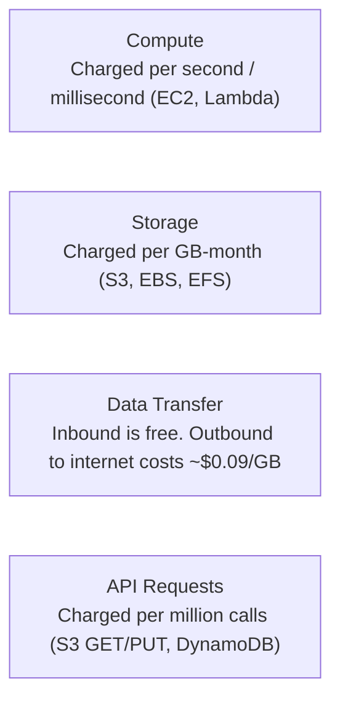

# Pricing & Cost Management

Understanding how AWS charges for services and utilizing native cost-control tools prevents unexpected bills and optimizes your cloud spend.

---

## 1. How AWS Pricing Works

AWS operates primarily on a **utility-based pay-as-you-go** model across four primary cost dimensions:

1. **Compute:** Billed by the second or millisecond (e.g., EC2 instances per second while running, Lambda per millisecond of execution duration).
2. **Storage:** Billed per GB per month for data residing on disks or object stores (e.g., EBS volumes, S3 buckets).
3. **Data Transfer (Egress):** 
    - **Inbound data transfer** from the internet into AWS is **completely free**.
    - **Data transfer between AWS services in the same AZ** is generally **free**.
    - **Outbound data transfer (egress)** from AWS to the public internet incurs standard per-GB fees.
4. **Requests & Operations:** Billed per million HTTP requests or capacity read/write units (e.g., DynamoDB, API Gateway, S3 requests).

---

## 2. Essential Cost Management Tools

| Tool | Purpose | Primary Action |
|---|---|---|
| **AWS Cost Explorer** | Visual analysis & trend forecasting | Identify which services and regions drive historical spending |
| **AWS Budgets** | Proactive thresholds & alerts | Receive automated email notifications when spending exceeds planned limits |
| **AWS Billing Dashboard** | Real-time invoice tracking | View month-to-date accumulated charges |
| **AWS Cost Allocation Tags** | Cost attribution | Tag resources by `Environment`, `Owner`, or `Project` for granular cost tracking |
| **AWS Pricing Calculator** | Pre-deployment estimation | Model monthly costs before provisioning infrastructure |

---

## 3. Practical Rules to Avoid Surprise Bills

!!! danger "Top Beginner Cost Traps"
    1. **Stopping vs. Terminating EC2:** Stopping an EC2 instance halts compute charges, but attached **EBS volumes** continue to incur storage fees. Delete or terminate instances when done.
    2. **Unused Elastic IP Addresses:** AWS charges a small hourly fee for Elastic IPs that are allocated but **not attached** to a running instance.
    3. **Idle Load Balancers & NAT Gateways:** ALBs and NAT Gateways incur a fixed baseline hourly charge (~$30+/month for a NAT Gateway) even if zero traffic passes through them.
    4. **Forgotten Database Snapshots:** Lingering automated snapshots and manual DB backups incur monthly S3 storage costs.

---

## 4. Cost Optimization Checklist

- [ ] Set up an **AWS Budget** and a **CloudWatch Billing Alarm** at `$5` or `$10` on day one.
- [ ] Implement **S3 Lifecycle Rules** to transition stale data to colder tiers (`Glacier Instant` / `Deep Archive`).
- [ ] Adopt **AWS Graviton (ARM64)** processors for EC2 and Lambda for an immediate ~20% discount.
- [ ] Use **EC2 Auto Scaling** to scale instance counts down to zero or minimal baseline during off-peak hours.
- [ ] Purchase **Savings Plans** or **Reserved Instances** once production workload baselines stabilize.
