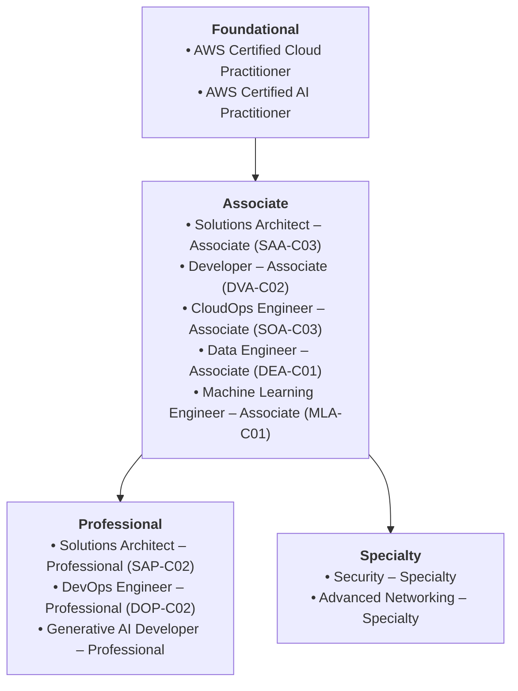

# Certifications & Learning Resources

A curated roadmap for building practical skills, validating knowledge with certifications, and exploring official AWS resources.

---

## 1. AWS Certification Roadmap (2026)

AWS offers official certifications structured across Foundational, Associate, Professional, and Specialty tiers:

### Where Should You Start?

- **Non-Technical / Pure Beginners:** Start with **AWS Certified Cloud Practitioner** (broad overview of cloud concepts and pricing).
- **Aspiring AI / ML Engineers:** Start with **AWS Certified AI Practitioner** followed by **Machine Learning Engineer – Associate**.
- **Software Engineers & IT Professionals:** Skip straight to **AWS Certified Solutions Architect – Associate (SAA-C03)** — the single most respected and in-demand certification for cloud architecture.

---

## 2. Official Free Learning Resources

| Resource | Description | Link |
|---|---|---|
| **AWS Free Tier** | Free hands-on experimentation allowances and credits | [aws.amazon.com/free](https://aws.amazon.com/free) |
| **AWS Skill Builder** | 600+ free official digital courses and learning plans | [skillbuilder.aws](https://skillbuilder.aws) |
| **AWS Documentation** | Official developer guides, API references, and tutorials | [docs.aws.amazon.com](https://docs.aws.amazon.com) |
| **AWS Architecture Center** | Reference architectures, whitepapers, and Well-Architected lenses | [aws.amazon.com/architecture](https://aws.amazon.com/architecture) |
| **AWS Pricing Calculator** | Estimate monthly costs for cloud architectures | [calculator.aws](https://calculator.aws) |
| **AWS Official YouTube** | Deep-dive webinars, re:Invent sessions, and demos | [youtube.com/@amazonwebservices](https://youtube.com/@amazonwebservices) |

---

## 3. Recommended Hands-On Beginner Projects

1. **Host a Static Portfolio Website:** Deploy HTML/CSS on S3, configure CloudFront CDN, secure with ACM SSL, and map to a Route 53 domain with Origin Access Control.
2. **Launch a Scalable Web Server:** Create a custom VPC with public and private subnets, launch an EC2 instance running Nginx, and configure Security Groups.
3. **Build a Serverless REST API:** Connect an API Gateway endpoint to a Python Lambda function that reads and writes JSON items to DynamoDB.
4. **Deploy an AI Chatbot with Amazon Bedrock:** Write a lightweight script using `boto3` that queries Anthropic Claude or Amazon Nova models via the Bedrock Converse API.
5. **Containerize with AWS Fargate:** Build a Docker image, push it to Amazon ECR (Elastic Container Registry), and launch it as a serverless container on ECS Fargate.
6. **Set Up Automated Backups & Monitoring:** Create a CloudWatch billing alarm and an EventBridge rule that captures daily EBS snapshots.

---

## 4. Key Services Summary Table

| Category | Primary Services |
|---|---|
| **Compute** | Amazon EC2, AWS Lambda, Amazon ECS, Amazon EKS, AWS Fargate, AWS App Runner |
| **Storage** | Amazon S3, Amazon EBS, Amazon EFS, Amazon S3 Glacier |
| **Database** | Amazon RDS, Amazon Aurora, Amazon DynamoDB, Amazon ElastiCache (Valkey/Redis), Amazon Redshift |
| **Networking** | Amazon VPC, Amazon Route 53, Amazon CloudFront, Elastic Load Balancing (ALB/NLB) |
| **AI & ML** | Amazon Bedrock, Bedrock AgentCore, Amazon Nova, Amazon SageMaker, Amazon Q Developer |
| **Security & Identity** | AWS IAM, IAM Identity Center, AWS KMS, AWS Secrets Manager, AWS WAF, AWS Shield |
| **Monitoring & Governance** | Amazon CloudWatch, AWS CloudTrail, AWS Config, Amazon EventBridge |
| **Developer & IaC** | AWS CLI, AWS SDKs, AWS CDK, AWS CloudFormation |
