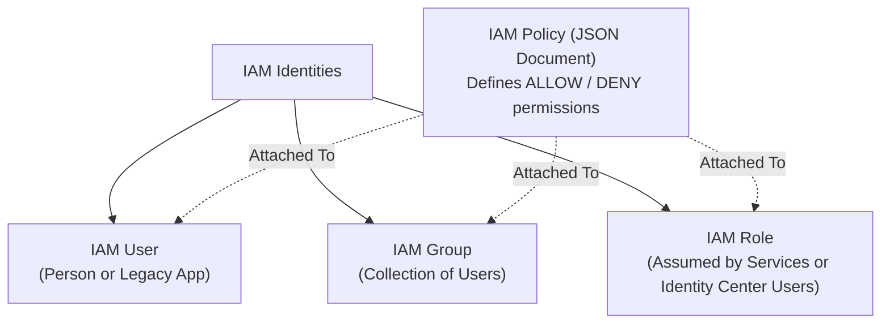
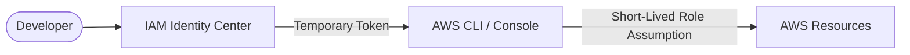

# Identity & Security (IAM)

Security is AWS's number one priority. **AWS Identity and Access Management (IAM)** is the foundational security service that controls **who** can authenticate (sign in) and **what** permissions they are authorized to perform across your AWS account.

---

## 1. Core IAM Building Blocks



| IAM Entity | Description | Common Use Case |
|---|---|---|
| **User** | An individual identity created inside AWS | Legacy console access or dedicated service accounts |
| **Group** | A collection of IAM users | Managing permissions collectively (e.g., `Developers`, `Auditors`, `Admins`) |
| **Role** | A temporary identity assumed by trusted entities (specific users, roles, or AWS services) authorized by its trust policy | Granting EC2 instances or Lambda functions access to S3/DynamoDB without embedding API keys |
| **Policy** | A JSON document that explicitly grants or denies specific API actions | Attached to users, groups, or roles to define permissions boundary |

---

## 2. The Principle of Least Privilege

!!! warning "Security Golden Rule"
    Always grant the **absolute minimum permissions** required to complete a specific task — nothing more. Never grant `AdministratorAccess` or wildcard (`"Action": "*"`) permissions to application workloads.

---

## 3. Anatomy of an IAM Policy (JSON)

An IAM policy document contains one or more permission statements:

```json
{
  "Version": "2012-10-17",
  "Statement": [
    {
      "Sid": "AllowSpecificS3BucketAccess",
      "Effect": "Allow",
      "Action": [
        "s3:GetObject",
        "s3:PutObject",
        "s3:ListBucket"
      ],
      "Resource": [
        "arn:aws:s3:::my-production-assets",
        "arn:aws:s3:::my-production-assets/*"
      ]
    }
  ]
}
```

- **Effect:** `Allow` or `Deny` (Explicit `Deny` always overrides any `Allow`).
- **Action:** The specific AWS API calls allowed (e.g., `s3:GetObject`, `ec2:DescribeInstances`).
- **Resource:** The Amazon Resource Name (ARN) of the specific resource target.

---

## 4. Modern IAM Best Practice: IAM Identity Center (SSO)

While traditional IAM users with static access keys were standard in older guides, AWS now strongly recommends **IAM Identity Center** (formerly AWS SSO):



- **No Long-Lived Secrets:** Eliminates the security hazard of accidentally committing permanent AWS Access Keys to GitHub.
- **Short-Lived Credentials:** Developers authenticate via browser login (`aws sso login`), receiving temporary session tokens that expire automatically.

---

## 5. IAM Roles for AWS Services (Zero Hardcoded Keys)

When an EC2 instance or Lambda function needs to talk to S3 or DynamoDB:

1. Create an **IAM Role** with a policy allowing S3/DynamoDB access.
2. Define a **Trust Policy** allowing the service (`ec2.amazonaws.com` or `lambda.amazonaws.com`) to assume the role.
3. Attach the Role to your EC2 instance (as an *Instance Profile*) or Lambda configuration.
4. The AWS SDK running in your code automatically fetches rotating credentials via the instance metadata service (IMDSv2). **Never hardcode secrets in source code.**

---

## 6. Key Security Services to Know

- **AWS KMS (Key Management Service):** Centralized service for creating and controlling cryptographic encryption keys used to encrypt data at rest across S3, EBS, RDS, and DynamoDB.
- **AWS Secrets Manager:** Securely stores, rotates, and retrieves database credentials, OAuth tokens, and third-party API keys at runtime.
- **AWS WAF (Web Application Firewall):** Protects web apps and APIs against common web exploits (SQL injection, Cross-Site Scripting, bot scraping).
- **Amazon GuardDuty:** Intelligent threat detection service that continuously monitors AWS accounts and workloads for malicious activity using machine learning.
