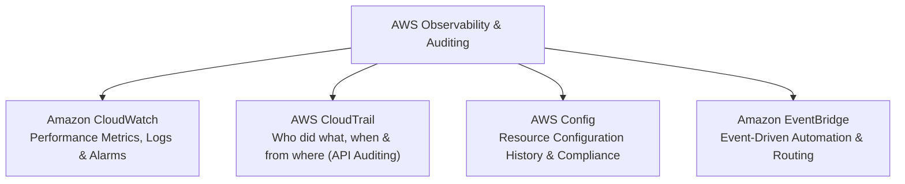
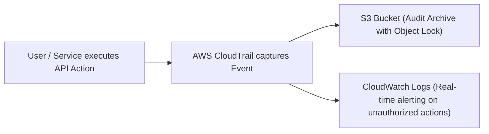

# Monitoring & Logging Services

Monitoring provides deep visibility into the performance, health, and security posture of your cloud infrastructure.

---

## 1. Amazon CloudWatch (Observability)

**Amazon CloudWatch** is AWS's centralized monitoring, observability, and alerting service.

### Core CloudWatch Features

- **Metrics:** Numerical time-series data measuring resource performance (e.g., EC2 CPU utilization, network traffic, Lambda execution count).
- **Logs:** Aggregates, searches, and stores application and system log files (from EC2, Lambda, ECS, Route 53, etc.) in real time.
- **Alarms:** Triggers automated notifications (via Amazon SNS) or operational actions (such as EC2 Auto Scaling or instance reboot) when a metric crosses a defined threshold.
- **Dashboards:** Custom visualization boards combining graphs, alarms, and widgets in a single pane of glass.

### Key Metrics by Service

| Service | Essential Metrics to Monitor |
|---|---|
| **EC2** | `CPUUtilization`, `NetworkIn`, `NetworkOut`, `DiskReadOps`, `StatusCheckFailed` |
| **RDS** | `CPUUtilization`, `DatabaseConnections`, `FreeStorageSpace`, `ReadLatency`, `WriteLatency` |
| **Lambda** | `Invocations`, `Errors`, `Duration`, `Throttles`, `ConcurrentExecutions` |
| **S3** | `BucketSizeBytes`, `NumberOfObjects`, `4xxErrors`, `5xxErrors` |
| **Application Load Balancer** | `RequestCount`, `TargetResponseTime`, `HTTPCode_Target_5XX_Count` |

---

## 2. AWS CloudTrail (Governance & API Auditing)

**AWS CloudTrail** records API calls and account activity made in your AWS account — whether invoked from the AWS Console, AWS CLI, SDKs, or internal AWS services.

### Understanding CloudTrail Event Types

- **Management Events (Control Plane):** Enabled by default in **CloudTrail Event History** across all regions at no cost, with **90 days of retention**. Covers operations like creating an EC2 instance, modifying an IAM policy, or provisioning a VPC.
- **Data Events (Data Plane):** High-volume resource operations (such as S3 object-level `GetObject`/`PutObject` or Lambda `InvokeFunction`). Data events are **not recorded by default** and must be explicitly configured on an active Trail.
- **Insights Events:** Optional anomaly detection that flags unusual API call spikes or error rates.

### CloudTrail Log Details

Each recorded event contains:
- **Who:** The IAM user, assumed role, or AWS service identity.
- **What:** The exact API action executed (e.g., `DeleteBucket`, `AuthorizeSecurityGroupIngress`, `RunInstances`).
- **When:** The exact UTC timestamp.
- **From Where:** The source IP address and user agent.

!!! warning "Audit & Immutability Best Practice"
    CloudTrail log deliveries are **not immutable by default**. For compliance and tamper-proof security auditing:
    
    1. Create an organizational, multi-Region Trail delivering to a dedicated, encrypted S3 bucket.
    2. Enable **CloudTrail Log File Validation** (uses SHA-256 digital signatures).
    3. Enforce **S3 Object Lock (WORM - Write Once, Read Many)** and strict bucket policies on the audit S3 bucket.
